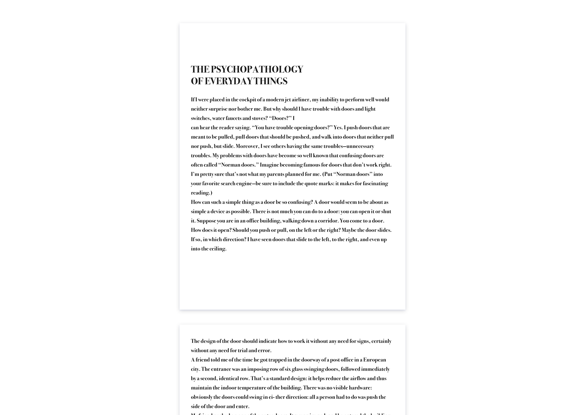

# Create a 'Page Layout' style

## Preview

## Task

Use the text that you can find in the [text.md](./text.md) create a website and copy the text and markup it. Make sure to use semantic tags. In the markdown page breaks are shown with `---`.

Font: Arapey
